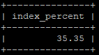

# [Домашнее задание](https://github.com/milanetology/sdb-homeworks/blob/6dd01f5c35a41d9a788e21260a95c4eac81d2063/12-05.md) к занятию "`Индексы`" - `Янин Семён Васильевич`


### Инструкция по выполнению домашнего задания

   1. Сделайте `fork` данного репозитория к себе в Github и переименуйте его по названию или номеру занятия, например, https://github.com/имя-вашего-репозитория/git-hw или  https://github.com/имя-вашего-репозитория/7-1-ansible-hw).
   2. Выполните клонирование данного репозитория к себе на ПК с помощью команды `git clone`.
   3. Выполните домашнее задание и заполните у себя локально этот файл README.md:
      - впишите вверху название занятия и вашу фамилию и имя
      - в каждом задании добавьте решение в требуемом виде (текст/код/скриншоты/ссылка)
      - для корректного добавления скриншотов воспользуйтесь [инструкцией "Как вставить скриншот в шаблон с решением](https://github.com/netology-code/sys-pattern-homework/blob/main/screen-instruction.md)
      - при оформлении используйте возможности языка разметки md (коротко об этом можно посмотреть в [инструкции  по MarkDown](https://github.com/netology-code/sys-pattern-homework/blob/main/md-instruction.md))
   4. После завершения работы над домашним заданием сделайте коммит (`git commit -m "comment"`) и отправьте его на Github (`git push origin`);
   5. Для проверки домашнего задания преподавателем в личном кабинете прикрепите и отправьте ссылку на решение в виде md-файла в вашем Github.
   6. Любые вопросы по выполнению заданий спрашивайте в чате учебной группы и/или в разделе “Вопросы по заданию” в личном кабинете.
   
Желаем успехов в выполнении домашнего задания!
   
### Дополнительные материалы, которые могут быть полезны для выполнения задания

1. [Руководство по оформлению Markdown файлов](https://gist.github.com/Jekins/2bf2d0638163f1294637#Code)

---

### Задание 1

```sql
SELECT ROUND(SUM(index_length) / SUM(data_length + index_length) * 100, 2) AS index_percent
FROM information_schema.TABLES 
WHERE table_schema = 'sakila';
```



---

### Задание 2


1. В `date(p.payment_date) = '2005-07-30'` нельзя использовать индексы
2. В WHERE не используется `film f`
3. `distinct` необязателен

```sql
CREATE INDEX idx_payment_date ON payment(payment_date);

SELECT DISTINCT CONCAT(c.last_name, ' ', c.first_name), SUM(p.amount) OVER (partition by c.customer_id, f.title)
FROM payment p, rental r, customer c, inventory i, film f
WHERE p.payment_date >= '2005-07-30 00:00:00' AND p.payment_date < '2005-07-31 00:00:00' AND p.payment_date = r.rental_date AND r.customer_id = c.customer_id AND i.inventory_id = r.inventory_id;
```

---
